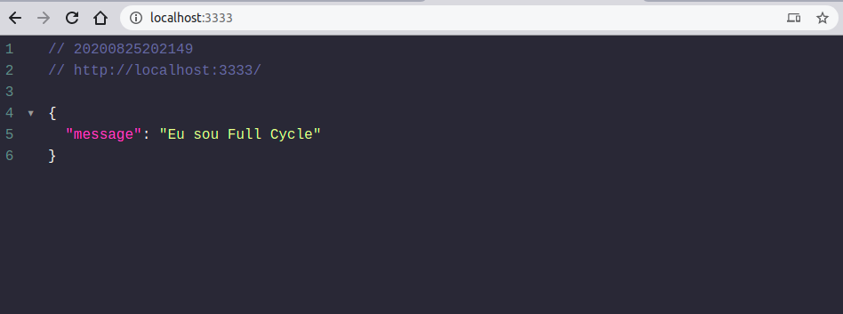

<h1 align="center">
    
</h1>

<h4 align="center"> 
	Docker Imagem personalizada com node server app 🐳
</h4>

<p align="center">
  
	
  <a href="https://www.linkedin.com/in/jeffersonsjunior/">
    
  </a>

  
</p>


## 💻 Sobre
Para fins de estudos, criei este repositório para quem quer uma direção de como criar uma imagem própria com o servidor web nodeJS, neste exemplo eu fiz um pequeno app com o expressJS e uma rota apontando a porta 3333, criei uma imagem com o Dockerfile para subir no meu repositório do <a href="https://hub.docker.com/r/jsoares1104/node-server-app">DockerHub</a>


## :hammer: Tecnologias

Este projeto foi desenvolvido com as seguintes Ferramentas:

- **[TypeScript](https://www.typescriptlang.org/)**
- **[Node.js](https://nodejs.org/en/)**
- **[Express](https://expressjs.com/)**
- **[Docker](https://www.docker.com/)**

## 🚀 Como rodar este projeto

Para clonar e executar este aplicativo, você precisará de [Git](https://git-scm.com), [Docker](https://www.docker.com/) Instalado em seu computador.


### :cyclone: Clonando o repositório, fazendo build da imagem e executando o container

```bash
# Clone este repositório
$ git clone https://github.com/jefferson1104/docker-nodeJS-example

# Acesse a pasta do projeto no terminal/cmd
$ cd docker-nodeJS-example

# Para fazer o build e criar a imagem
$ docker build -t usernamedockerhub/node-server . 

# Executando a imagem criada 
sudo docker run --name node-server -p 3333:3333 usernamedockerhub/node-server

```

Com o container sendo executado você pode abrir seu navegador e testar a aplicação no localhost:3333, voce ira visualizar uma resposta de uma mensagem em JSON parecida com esta como mostra na imagem abaixo:

<h1 align="center">
    
</h1>


## :memo: Licença

Este projeto esta sobe a licença MIT. Veja a [LICENÇA](https://opensource.org/licenses/MIT) para saber mais.
